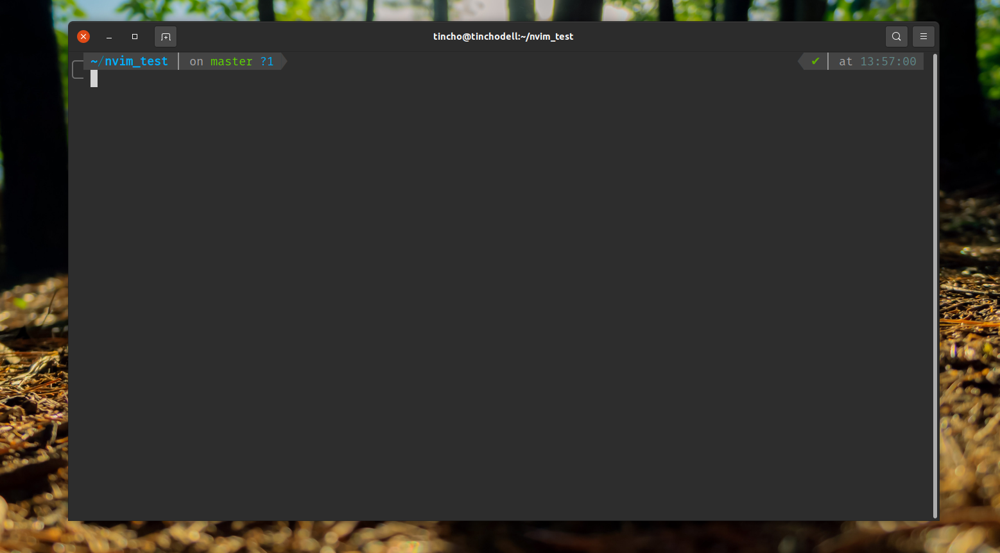

# Installing ZSH shell for linux distros
1. Install zsh with your package manager
```
sudo apt install zsh
```
2. Make your default shell

```
chsh -s $(which zsh)
```

3. Restart your terminal and you are ready to go (In linux ubuntu you may need to logout and login again)

4. Installing Oh My Zsh

```
sh -c "$(curl -fsSL https://raw.githubusercontent.com/robbyrussell/oh-my-zsh/master/tools/install.sh)"
```

5. Install PowerLeve10K theme

```
git clone https://github.com/romkatv/powerlevel10k.git $ZSH_CUSTOM/themes/powerlevel10k
```

6. Download firamono font 

```
https://github.com/ryanoasis/nerd-fonts/blob/master/patched-fonts/FiraMono/Regular/complete/Fira%20Mono%20Regular%20Nerd%20Font%20Complete.otf?raw=true
```

**UPDATE:
INSTALL OTHER FONT (FIRACODE) BECAUSE THE OLD ONE IS NOT WORKING WITH UBUNTU 22.04**

7. Download Plugins for autosuggestion and syntax highlighting

```
git clone https://github.com/zsh-users/zsh-autosuggestions.git $ZSH_CUSTOM/plugins/zsh-autosuggestions
```

```
git clone https://github.com/zsh-users/zsh-syntax-highlighting.git $ZSH_CUSTOM/plugins/zsh-syntax-highlighting
```

8. Edit zsh conf

```
vim ~/.zshrc

ZSH_THEME="powerlevel10k/powerlevel10k"

POWERLEVEL9K_MODE="nerdfont-complete"

plugins=(git zsh-autosuggestions zsh-syntax-highlighting)
```

9. Change font from terminal settings.


10. Install custom themes using:

```
bash -c  "$(wget -qO- https://git.io/vQgMr)"
```

11. Set zsh as default shell

Normal Auth:

```
chsh -s $(which zsh)
```

LDAP workaround: edit .bashrc file and place the following code at the end:

```
if [ -x /usr/bin/zsh ]; then
  echo '[+] Starting zsh...'
  # export SHELL=/bin/zsh #edit: this is probably not what you want, see the comment.
  exec /usr/bin/zsh
fi
```


Result:


